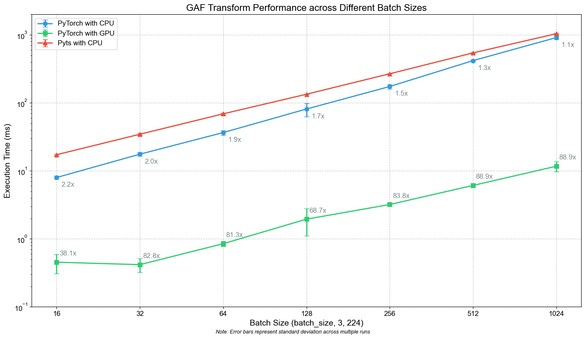

# PyTorchGAF: PyTorch-accelerated implementation of the Gramian Angualr Field (GAF)

The provided GAF implementation uses pure PyTorch which provides several benefits:
- Supports batched data.
- Allows to use the GAF transform directly as a neural network layer.
- Allows directly transforming the data on the target device (CPU or GPU).
- Uses efficient vectorized Einstein Summation Notation to compute the outer products to avoid using loops.


## Optimizations

Our implementation is based on the GAF transform from pyts. However, as Figure 1 shows the GAF transform significantly benefits from GPU acceleration achieving speedups of almost 90x for larger batch sizes.


*Figure 1: Execution time comparison between CPU-based pyts implementation and our implementation on CPU and GPU.*


## Usage/Examples

```python
import torch

gaf = GAFTransform(method="summation")
inputs = torch.randn(32, 8, 40, device="cuda")  # (N, C, L)
output = gaf(inputs)  # (N, C, L, L)
```


## Acknowledgements

 - [pyts GitHub](https://github.com/johannfaouzi/pyts)
 - [pyts GAF](https://github.com/johannfaouzi/pyts/blob/main/pyts/image/gaf.py)
